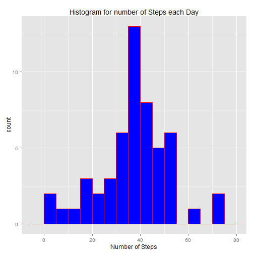
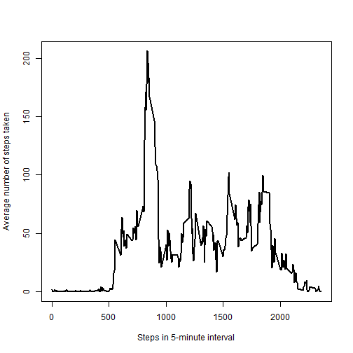
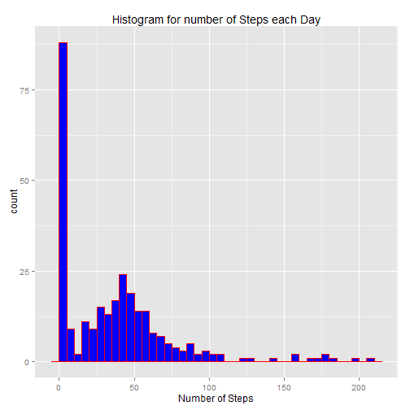
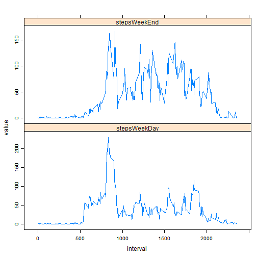

```r
#loading the necessarie libraries
library(dplyr)
library(ggplot2)
library(lubridate)
#Loading data (assuming that the activity.csv is in the same folder as PA1_template.html)
s <- read.csv("activity.csv")
```

# What is mean total number of steps taken per day? (For this part of the assignment, you can ignore the missing values in the dataset.)

__Make a histogram of the total number of steps taken each day__


```r
#removing na lines from data.frame
question1 <- na.omit(s)
#Aggregating steps by date
answer1 <- aggregate(steps ~ date, FUN = mean, data = question1)
numberOfStepsEachDay <- answer1$steps
qplot(numberOfStepsEachDay,
      geom="histogram",
      binwidth = 5,
      main = "Histogram for number of Steps each Day", 
      xlab = "Number of Steps",  
      fill=I("blue"), 
      col=I("red"))
```

 

__Calculate and report the mean and median total number of steps taken per day__

```r
mean(numberOfStepsEachDay)
```

```
## [1] 37.3826
```

```r
median(numberOfStepsEachDay)
```

```
## [1] 37.37847
```

# What is the average daily activity pattern? (For this part of the assignment, you can ignore the missing values in the dataset.)

__Make a time series plot (i.e. type = "l") of the 5-minute interval (x-axis) and the average number of steps taken, averaged across all days (y-axis)__


```r
# aggregating steps by interval
answer2 <- aggregate(steps ~ interval, FUN = mean, data = question1)
#calculating the mean for each day
plot(answer2$interval, answer2$steps, type='l', xlab= 'Steps in 5-minute interval', ylab= 'Average number of steps taken', col='black' , lwd=2)
```

 


```r
#Calculating the 5-minute interval with the maximum number of Steps
reverseOrder <- rev(order(answer2$steps))
maxNumberSteps5MinuteInterval <- answer2$interval[reverseOrder[1]]
```

__Which 5-minute interval, on average across all the days in the dataset, contains the maximum number of steps?__

```r
maxNumberSteps5MinuteInterval
```

```
## [1] 835
```


```r
# Calculating the total number of missing values in the dataset 
missingValues <- as.data.frame(is.na(s))
totalNumberOfMissingValues <- length(subset(missingValues$steps, missingValues$steps == TRUE))
```
__Calculate and report the total number of missing values in the dataset (i.e. the total number of rows with NAs)__

```r
totalNumberOfMissingValues
```

```
## [1] 2304
```


```r
# creating a new dataset filling the NA values with the mean value of the number of steps for each 5-minute interval
newDataset <- s
size <- length(newDataset$steps)
for (i in 1:size) {
  if (is.na(newDataset[i,1])) {
    newDataset[i,1] <- answer2[answer2$interval == newDataset[i,3],][2]
  }
}
```

__histogram of the total number of steps taken each day after missing values were imputed__


```r
# aggregating steps by interval
answer3 <- aggregate(steps ~ interval, FUN = mean, data = newDataset)
#calculating steps each day *after* missing data is populated
numberOfStepsEachDayAfterMissingData <- answer3$steps
qplot(numberOfStepsEachDayAfterMissingData,
      geom="histogram",
      binwidth = 5,
      main = "Histogram for number of Steps each Day", 
      xlab = "Number of Steps",  
      fill=I("blue"), 
      col=I("red"))
```

 

# Are there differences in activity patterns between weekdays and weekends?

__Create a new factor variable in the dataset with two levels - "weekday" and "weekend" indicating whether a given date is a weekday or weekend day.__


```r
# Creating a new factor indicating whether a given date is a weekday or weekend day
newDataset$date <- as.Date(newDataset$date)
# for each date, wday function indicates the order on the weekend
listDays <- wday(newDataset$date)
# days 1 (sunday) and 7 (saturday) assigned as weekend. 
listWeekdays <- lapply(listDays, function(x){if((x == 1) || (x == 7)) "weekend" else "weekday"})
# inserting new column in data.frame
newDataset$dayType <- listWeekdays
```

__Make a Panel Plot containing a time series plot (i.e. type = "l") on the 5-minute-interval (x-axis) and the average number of steps taken, averaged across all weekday days or weekend days (y-axis)__


```r
#subsetting the weekdays and weekends to build the plot
dataWeekend <- newDataset %>% filter(dayType == "weekend")
dataWeekday <- newDataset %>% filter(dayType == "weekday")
aggWeekend <- aggregate(steps ~ interval, FUN = mean, data = dataWeekend)
aggWeekday <- aggregate(steps ~ interval, FUN = mean, data = dataWeekday)
aggTotal <- aggWeekday
colnames(aggTotal) <- c("interval","stepsWeekDay")
aggTotal$stepsWeekEnd <- aggWeekend$steps
library(reshape2)
mm <- melt(subset(aggTotal, select = c(interval,stepsWeekDay, stepsWeekEnd)), id.var = "interval")
library(lattice)
xyplot(value~interval|variable, data = mm, type = "l",
       scales=list(y=list(relation="free")),
       layout = c(1,2))
```

 
